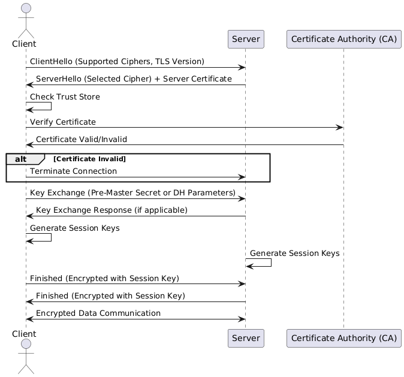

# Certificate Overview

This repository provides a comprehensive overview of digital certificates, including types, validation methods, use cases, and the role of Certificate Authorities (CAs) in digital security. The purpose is to create a reference for developers, system administrators, and anyone interested in understanding certificates, their importance, and their applications.

---

## Introduction

Digital certificates are essential for secure communications over the internet, offering 
- **encryption,**
- **authentication,**
- **and data integrity.** 
They are widely used to secure websites, sign software, verify email authenticity, and more. This repository serves as an educational resource for anyone seeking to understand certificates and how they contribute to online security.

## Certificate Types

### Validation Levels

Certificates are classified based on the validation level provided by the Certificate Authority (CA):

- **Domain Validation**: Basic validation to ensure domain ownership, typically involving DNS or email verification. Suitable for personal websites or internal testing.
- **Organization Validation**: Requires the CA to verify the organization's identity, adding credibility. Commonly used by businesses to establish trust with their users.
- **Extended Validation**: The highest level of validation, with extensive background checks on the organization. EV certificates often display the organization’s name in the browser’s address bar, enhancing user trust.

### Usage and Scope

Certificates can also differ based on their scope and usage:

- **Single-Domain Certificates**: Secure a single domain, such as `example.com`.
- **Wildcard Certificates**: Secure a domain and all of its subdomains at one level (e.g., `*.example.com`).
- **Multi-Domain Certificates (SAN/UCC)**: Secure multiple domains and/or subdomains in one certificate, ideal for complex setups with multiple services (e.g., `example.com`, `example.net`, `sub.example.com`).

### Specialized Certificates

There are also specialized certificates tailored to specific use cases:

- **Code-Signing Certificates**: Verify the integrity and origin of software, preventing tampering or unauthorized alterations.
- **E-Mail Certificates (S/MIME)**: Enable email encryption and authentication, ensuring the security and authenticity of email communications.
- **Client Certificates**: Authenticate users or devices, often used in corporate environments to secure access to sensitive systems.
- **Root and Intermediate Certificates**: Foundational certificates used by CAs to build trust chains, validating other issued certificates.


## How Certificates Work

### Structure of a digital certificate

| Field                     | Description                                                                                     |
|---------------------------|-------------------------------------------------------------------------------------------------|
| Common Name               | The domain name for which the certificate is issued.                                           |
| Issued By                 | The organization (Certificate Authority) that issued the certificate.                          |
| Issuing Certificate       | The intermediate certificate used to sign this certificate.                                    |
| Serial Number             | A unique identifier assigned to the certificate by the Certificate Authority.                  |
| Valid From                | The start date and time when the certificate becomes valid.                                     |
| Valid To                  | The end date and time when the certificate expires.                                            |
| Key Usage                 | Specifies the purpose of the certificate's public key (e.g., digital signature, key encipherment). |
| Extended Key Usage        | Further specifies the certificate's usage, such as TLS server or client authentication.         |
| Basic Constraints         | Indicates whether the certificate can act as a CA (e.g., "CA:FALSE" means it cannot issue certificates). |
| Subject Key Identifier    | A unique identifier for the certificate's public key, helping to differentiate keys.           |
| Authority Key Identifier  | Identifies the public key associated with the certificate's issuing CA.                        |
| Authority Info Access     | Provides information about the CA, including an OCSP responder URL and a link to the CA's certificate. |
| Subject Alternative Names | Lists additional domain names or IP addresses covered by the certificate.                      |

#### Example
```
-----BEGIN CERTIFICATE-----
MIIHbjCCBlagAwIBAgIQB1vO8waJyK3fE+Ua9K/hhzANBgkqhkiG9w0BAQsFADBZ
MQswCQYDVQQGEwJVUzEVMBMGA1UEChMMRGlnaUNlcnQgSW5jMTMwMQYDVQQDEypE
aWdpQ2VydCBHbG9iYWwgRzIgVExTIFJTQSBTSEEyNTYgMjAyMCBDQTEwHhcNMjQw
MTMwMDAwMDAwWhcNMjUwMzAxMjM1OTU5WjCBljELMAkGA1UEBhMCVVMxEzARBgNV
BAgTCkNhbGlmb3JuaWExFDASBgNVBAcTC0xvcyBBbmdlbGVzMUIwQAYDVQQKDDlJ
bnRlcm5ldMKgQ29ycG9yYXRpb27CoGZvcsKgQXNzaWduZWTCoE5hbWVzwqBhbmTC
oE51bWJlcnMxGDAWBgNVBAMTD3d3dy5leGFtcGxlLm9yZzCCASIwDQYJKoZIhvcN
AQEBBQADggEPADCCAQoCggEBAIaFD7sO+cpf2fXgCjIsM9mqDgcpqC8IrXi9wga/
9y0rpqcnPVOmTMNLsid3INbBVEm4CNr5cKlh9rJJnWlX2vttJDRyLkfwBD+dsVvi
vGYxWTLmqX6/1LDUZPVrynv/cltemtg/1Aay88jcj2ZaRoRmqBgVeacIzgU8+zmJ
7236TnFSe7fkoKSclsBhPaQKcE3Djs1uszJs8sdECQTdoFX9I6UgeLKFXtg7rRf/
hcW5dI0zubhXbrW8aWXbCzySVZn0c7RkJMpnTCiZzNxnPXnHFpwr5quqqjVyN/aB
KkjoP04Zmr+eRqoyk/+lslq0sS8eaYSSHbC5ja/yMWyVhvMCAwEAAaOCA/IwggPu
MB8GA1UdIwQYMBaAFHSFgMBmx9833s+9KTeqAx2+7c0XMB0GA1UdDgQWBBRM/tAS
TS4hz2v68vK4TEkCHTGRijCBgQYDVR0RBHoweIIPd3d3LmV4YW1wbGUub3Jnggtl
eGFtcGxlLm5ldIILZXhhbXBsZS5lZHWCC2V4YW1wbGUuY29tggtleGFtcGxlLm9y
Z4IPd3d3LmV4YW1wbGUuY29tgg93d3cuZXhhbXBsZS5lZHWCD3d3dy5leGFtcGxl
Lm5ldDA+BgNVHSAENzA1MDMGBmeBDAECAjApMCcGCCsGAQUFBwIBFhtodHRwOi8v
d3d3LmRpZ2ljZXJ0LmNvbS9DUFMwDgYDVR0PAQH/BAQDAgWgMB0GA1UdJQQWMBQG
CCsGAQUFBwMBBggrBgEFBQcDAjCBnwYDVR0fBIGXMIGUMEigRqBEhkJodHRwOi8v
Y3JsMy5kaWdpY2VydC5jb20vRGlnaUNlcnRHbG9iYWxHMlRMU1JTQVNIQTI1NjIw
MjBDQTEtMS5jcmwwSKBGoESGQmh0dHA6Ly9jcmw0LmRpZ2ljZXJ0LmNvbS9EaWdp
Q2VydEdsb2JhbEcyVExTUlNBU0hBMjU2MjAyMENBMS0xLmNybDCBhwYIKwYBBQUH
AQEEezB5MCQGCCsGAQUFBzABhhhodHRwOi8vb2NzcC5kaWdpY2VydC5jb20wUQYI
KwYBBQUHMAKGRWh0dHA6Ly9jYWNlcnRzLmRpZ2ljZXJ0LmNvbS9EaWdpQ2VydEds
b2JhbEcyVExTUlNBU0hBMjU2MjAyMENBMS0xLmNydDAMBgNVHRMBAf8EAjAAMIIB
fQYKKwYBBAHWeQIEAgSCAW0EggFpAWcAdABOdaMnXJoQwzhbbNTfP1LrHfDgjhuN
acCx+mSxYpo53wAAAY1b0vxkAAAEAwBFMEMCH0BRCgxPbBBVxhcWZ26a8JCe83P1
JZ6wmv56GsVcyMACIDgpMbEo5HJITTRPnoyT4mG8cLrWjEvhchUdEcWUuk1TAHYA
fVkeEuF4KnscYWd8Xv340IdcFKBOlZ65Ay/ZDowuebgAAAGNW9L8MAAABAMARzBF
AiBdv5Z3pZFbfgoM3tGpCTM3ZxBMQsxBRSdTS6d8d2NAcwIhALLoCT9mTMN9OyFz
IBV5MkXVLyuTf2OAzAOa7d8x2H6XAHcA5tIxY0B3jMEQQQbXcbnOwdJA9paEhvu6
hzId/R43jlAAAAGNW9L8XwAABAMASDBGAiEA4Koh/VizdQU1tjZ2E2VGgWSXXkwn
QmiYhmAeKcVLHeACIQD7JIGFsdGol7kss2pe4lYrCgPVc+iGZkuqnj26hqhr0TAN
BgkqhkiG9w0BAQsFAAOCAQEABOFuAj4N4yNG9OOWNQWTNSICC4Rd4nOG1HRP/Bsn
rz7KrcPORtb6D+Jx+Q0amhO31QhIvVBYs14gY4Ypyj7MzHgm4VmPXcqLvEkxb2G9
Qv9hYuEiNSQmm1fr5QAN/0AzbEbCM3cImLJ69kP5bUjfv/76KB57is8tYf9sh5ik
LGKauxCM/zRIcGa3bXLDafk5S2g5Vr2hs230d/NGW1wZrE+zdGuMxfGJzJP+DAFv
iBfcQnFg4+1zMEKcqS87oniOyG+60RMM0MdejBD7AS43m9us96Gsun/4kufLQUTI
FfnzxLutUV++3seshgefQOy5C/ayi8y1VTNmujPCxPCi6Q==
-----END CERTIFICATE-----
````
Decoded:

| Field                     | Value                                                                                  |
|---------------------------|----------------------------------------------------------------------------------------------|
| Common Name                 | www.example.org|
| Issued By                   | DigiCert Inc |
| Issuing Certificate         | DigiCert Global G2 TLS RSA SHA256 2020 CA1|
| Serial Number               |075BCEF30689C8ADDF13E51AF4AFE187|
| Valid From                  | 00:00:00 30 Jan 2024|
| Valid To                    | 23:59:59 01 Mar 2025 |
| Key Usage                   | Digital Signature, Key Encipherment|
| Extended Key Usage          | TLS Web Server Authentication, TLS Web Client Authentication|
| Basic Constraints           |CA:FALSE|
|Subject Key Identifier       | 4C:FE:D0:12:4D:2E:21:CF:6B:FA:F2:F2:B8:4C:49:02:1D:31:91:8A|
|Authority Key Identifier     |74:85:80:C0:66:C7:DF:37:DE:CF:BD:29:37:AA:03:1D:BE:ED:CD:17|
|Authority Info Access        |OCSP - URI:http://ocsp.digicert.com CA Issuers - URI:http://cacerts.digicert.com/DigiCertGlobalG2TLSRSASHA2562020CA1-1.crt|
|Subject Alternative Names    |DNS:www.example.org, DNS:example.net, DNS:example.edu, DNS:example.com, DNS:example.org, DNS:www.example.com, DNS:www.example.edu, DNS:www.example.net|

### TLS/HTTPS

TLS (Transport Layer Security) is the protocol that underpins HTTPS, providing secure communication over a network. A server certificate is a critical component in this process, enabling encrypted communication and verifying the server’s identity. Here’s how it works step-by-step:

1. Client Initiates a Connection

	•	The client (e.g., a web browser) sends a request to the server to establish a secure connection. This request is known as a “ClientHello.”
	•	The ClientHello includes information about supported cryptographic algorithms (ciphers), the TLS version, and other settings.

2. Server Responds

	•	The server responds with a “ServerHello,” selecting the cryptographic algorithms to use.
	•	The server also sends its digital certificate as part of the response.

3. Server Certificate

	•	The server certificate is issued by a trusted Certificate Authority (CA) and contains:
	•	The server’s domain name.
	•	The server’s public key.
	•	The CA’s digital signature.
	•	Expiry and validity information.
	•	The client validates the certificate:
	•	Verifies the CA’s signature to ensure the certificate has not been tampered with.
	•	Checks that the certificate is issued for the requested domain.
	•	Ensures the certificate is still valid (not expired or revoked).

4. Key Exchange

	•	The client and server perform a key exchange to establish a shared secret for encryption. Depending on the chosen method, this can involve:
	•	RSA: The client uses the server’s public key to encrypt a randomly generated pre-master secret, which only the server can decrypt with its private key.
	•	Elliptic Curve Diffie-Hellman (ECDH) or Diffie-Hellman (DH): Both parties contribute to generating a shared secret without directly transmitting it.

5. Session Key Generation

	•	Using the shared secret, the client and server independently compute the same session keys. These keys are symmetric and are used for encrypting communication during the session.

6. Secure Communication

	•	Both parties now use the session keys to encrypt and decrypt data, ensuring confidentiality and integrity.

7. Data Transmission

	•	All subsequent communication between the client and server is encrypted using the session keys.
	
	


Key Benefits of Using a Server Certificate in TLS/HTTPS

	1.	Encryption: Prevents eavesdropping by encrypting data in transit.
	2.	Authentication: Verifies the server’s identity, ensuring users connect to the intended website.
	3.	Data Integrity: Detects tampering or corruption of data during transmission.

Role of Certificate Authority (CA)

A CA acts as a trusted third party, vouching for the authenticity of the server certificate. Clients trust CAs implicitly because their root certificates are pre-installed in browsers and operating systems.

This combination of encryption, authentication, and integrity is what makes HTTPS secure.

### mTLS

TLS (Transport Layer Security) and mTLS (Mutual TLS) are both protocols that provide secure communication over a network. While they share foundational mechanisms, they differ primarily in their purpose and how authentication is handled. 
Here’s a detailed comparison:
| Aspect                     | TLS                                                | mTLS                                               |
|----------------------------|----------------------------------------------------|---------------------------------------------------|
| Purpose                    | Ensures secure communication by encrypting data and authenticating the server to the client. | Provides secure communication with mutual authentication, verifying both the client and the server. |
| Authentication             | Only the server is authenticated using a certificate. | Both the server and the client are authenticated using certificates. |
| Client Certificate         | Not required; the client is not authenticated using a certificate. | Required; the client must present a valid certificate to authenticate itself. |
| Use Case                   | Commonly used in web browsing, where only the server needs to prove its identity. | Used in environments requiring high security, such as API communication, financial systems, or microservices. |
| Complexity                 | Easier to set up, as it requires only a server certificate. | More complex to configure, as both server and client certificates need to be managed. |
| Examples                   | HTTPS websites, web applications, email encryption. | Secure APIs, B2B integrations, internal microservices communication. |
| Trust Verification         | The client verifies the server's certificate against a trusted Certificate Authority (CA). | Both the client and server verify each other's certificates against trusted CAs. |
| Certificate Management     | Requires management of server certificates only. | Requires managing certificates for both clients and servers, often necessitating an internal Public Key Infrastructure (PKI). |
| Scalability                | Scales well for large numbers of users (e.g., public-facing websites). | Can be challenging to scale due to the need for managing numerous client certificates. |

Summary:

	•	TLS: Ensures secure, encrypted communication with server authentication, making it suitable for general web and application security.
	•	mTLS: Adds an extra layer of security by authenticating both parties, making it ideal for secure, trust-bound environments such as APIs or internal systems.

### Certificate Lifecycle

Certificates have a lifecycle that includes issuance, renewal, and eventual expiration. Proper management of this lifecycle is critical to maintaining secure communications and avoiding service interruptions.

### Trust Chains

The trustworthiness of a certificate is based on a **Trust Chain**. This begins with a Root Certificate (trusted by default in most operating systems and browsers) and extends to Intermediate and End-Entity Certificates. Each certificate in the chain vouches for the one directly below it.

## Common Use Cases

Digital certificates are crucial for various applications, including:

- **Website Security (HTTPS)**: Encrypting data transmitted between users and websites.
- **Email Security**: Verifying the identity of the sender and encrypting email content.
- **API and IoT Communication**: Ensuring secure communication between servers, APIs, and IoT devices.
- **Software Distribution**: Ensuring software authenticity and integrity through code-signing certificates.

## Learning

 - [openssl](learning-openssl.md)

## Further Readings

 - [How HTTPS Works](https://howhttps.works/)
 - [Deep Dive PKI](deepdive-pki.md)
 - [Understanding Certificate Chains: A Simple Guide](https://github.com/nicanorflavier/ssl-certificate-chain-guide)

## Resources

For more detailed information, refer to the following:

- [Mozilla's CA Certificate Program](https://wiki.mozilla.org/CA)
- [Let's Encrypt Documentation](https://letsencrypt.org/docs/)
- [SSL/TLS Best Practices by OWASP](https://cheatsheetseries.owasp.org/cheatsheets/Transport_Layer_Protection_Cheat_Sheet.html)

---

## Contributing

Contributions are welcome! Please open an issue or submit a pull request if you would like to add new information or correct existing content.
